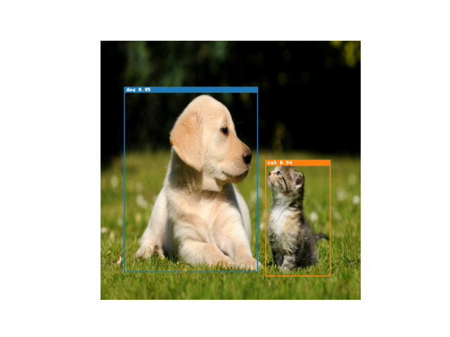

# EfficientDet - Tensorflow 2 


Custom implementation of [EfficientDet](https://arxiv.org/abs/1911.09070) using 
tensorflow 2.



## Pretrained weights

[](https://google.com)

How to use pretrained weights?

1. Download the weights by clicking the badge you prefer.
2. Unzip TODO
3. Load the model

```python
from efficientdet import EfficientDet

chckp_path = 'path_to_unzipped_dir'
# With pretrained classifiaction head
model = EfficientDet.from_pretrained(chckp_path)

# With custom head
# Note: This will initialize a random classifier head, so it requires
# fine tuning
model = EfficientDet.from_pretrained(chckp_path, 
                                     num_classes=<your_n_classes>)
```

## Training the model

Currenty this EfficientDet implementation supports training with 2 data formats:

- **labelme format**. This format corresponds to the [labelme](https://github.com/wkentaro/labelme)
annotations outputs.

- **VOC2007 format**. The format corresponds to the one described [here](http://host.robots.ox.ac.uk/pascal/VOC/voc2007/).

You can specify the data model on the training command.


## Installation

1. Clone the project

```
$ git clone https://github.com/Guillem96/efficientdet-tf.git
```

2. Navigate inside the project and run the following commands

```
$ cd efficientdet-tf
$ pip install numpy cython
$ pip install -U .
```

3. Done 

## Training Command Line Interface (CLI)

```
$ python -m efficientdet.train --help

Usage: train.py [OPTIONS]

Options:
  --efficientdet INTEGER          EfficientDet architecture. {0, 1, 2, 3, 4,
                                  5, 6, 7}
  --bidirectional / --no-bidirectional
                                  If bidirectional is set to false the NN will
                                  behave as a "normal" retinanet, otherwise as
                                  EfficientDet
  --freeze-backbone / --no-freeze-backbone
                                  Wether or not freeze EfficientNet backbone
  --epochs INTEGER                Number of epochs to train the model
  --batch-size INTEGER            Dataset batch size
  --grad-accum-steps INTEGER      Gradient accumulation steps. Simulates a
                                  larger batch size, for example if
                                  batch_size=16 and grad_accum_steps=2 the
                                  simulated batch size is 16 * 2 = 32
  --learning-rate FLOAT           Optimizer learning rate. It is recommended
                                  to reduce it in case backbone is not frozen
  --w-scheduler / --wo-scheduler  With learning rate scheduler or not. If left
                                  to true, --learning-rate option will act as
                                  max lr for the scheduler
  --print-freq INTEGER            Print training loss every n steps
  --validate-freq INTEGER         Print COCO evaluations every n epochs
  --format [VOC|labelme]          Dataset to use for training  [required]
  --train-dataset DIRECTORY       Path to annotations and images  [required]
  --val-dataset DIRECTORY         Path to validation annotations. If it is
                                  not set by the user, validation won't be
                                  performed
  --images-path DIRECTORY         Base path to images. Required when using
                                  labelme format  [required]
  --n-classes INTEGER             Number of important classes without taking
                                  background into account  [required]
  --classes-names TEXT            Only required when format is labelme. Name
                                  of classes separated using comma.
                                  class1,class2,class3
  --checkpoint PATH               Path to model checkpoint
  --save-dir DIRECTORY            Directory to save model weights  [required]
  --help                          Show this message and exit.
```

## Train the model with labelme format

The command below is the one that we should use if we want to train the model with
the data coming from [here](https://github.com/Guillem96/efficientdet-tf/tree/master/test/data/pokemon).

```
$ python -m efficientdet.train \
    --efficientdet 0 \
    --bidirectional \
    --no-freeze-backbone \

    --format labelme \
    --train-dataset test/data/pokemon \
    --images-path test/data/pokemon \
    --classes-names treecko,greninja,mewtwo,solgaleo,psyduck \
    --n-classes 5 \
    
    --epochs 20 \
    --batch-size 8 \
    --w-scheduler \
    --learning-rate 1e-2 \
    --grad-accum-steps 2 \

    --save-dir models/pokemon-models/
```

## Train the model with VOC 2007 format

The command below is the one that we should use if we want to train the model with
the data coming from [here](https://github.com/Guillem96/efficientdet-tf/tree/master/test/data/VOC2007).

```
$ python -m efficientdet.train \
    --efficientdet 0 \
    --bidirectional \
    --no-freeze-backbone \

    --train-dataset test/data/VOC2007 \
    --format VOC \
    --n-classes 20 \
    
    --epochs 20 \
    --batch-size 8 \
    --learning-rate 0.16 \
    --w-scheduler \

    --save-dir models/voc-models/
```

## Evaluate a model

```
$ python -m efficientdet.eval --help

Usage: eval.py [OPTIONS]

Options:
  --format [VOC|labelme]          Dataset to use for training  [required]
  --test-dataset DIRECTORY        Path to annotations and images  [required]
  --images-path DIRECTORY         Base path to images. Required when using
                                  labelme format  [required]
  --checkpoint PATH               Path to model checkpoint  [required]
  --help                          Show this message and exit.
```

## Using a trained model

```python
import tensorflow as tf
import efficientdet

effdet = efficientdet.EfficientDet.from_pretrained('...')

im_size = model.config.input_size
images  = tf.random.uniform((3, im_size, im_size, 3)) # 3 Mock images

boxes, labels, scores = effdet(images, training=False)

# labels -> List of tf.Tensor of shape [N,]
# boxes -> List of tf.Tensor of shape [N, 4]
# scores -> Confidence of each box
for im_boxes, im_labels in zip(boxes, labels):
    # Process boxes of a specific image
    ...
```

## Roadmap

- [ ] Visualization utils
- [x] Learning rate schedulers to speed up and enhance training
- [x] Proper evaluation using COCO mAP
- [ ] Define a custom data-format to train with custom datasets
- [ ] Reproduce similar paper results
- [ ] Migrate anchors code to Tensorflow
- [x] Data augmentation pipelines

## References

[1] [Focal Loss for Dense Object Detection - Tsung-Yi Lin Priya Goyal Ross Girshick Kaiming He Piotr Dollár](https://arxiv.org/abs/1708.02002)

[2] [EfficientDet: Scalable and Efficient Object Detection - {tanmingxing, rpang, qvl}@google.com](https://arxiv.org/abs/1911.09070)

[3] [Keras Retinanet](https://github.com/fizyr/keras-retinanet/)

